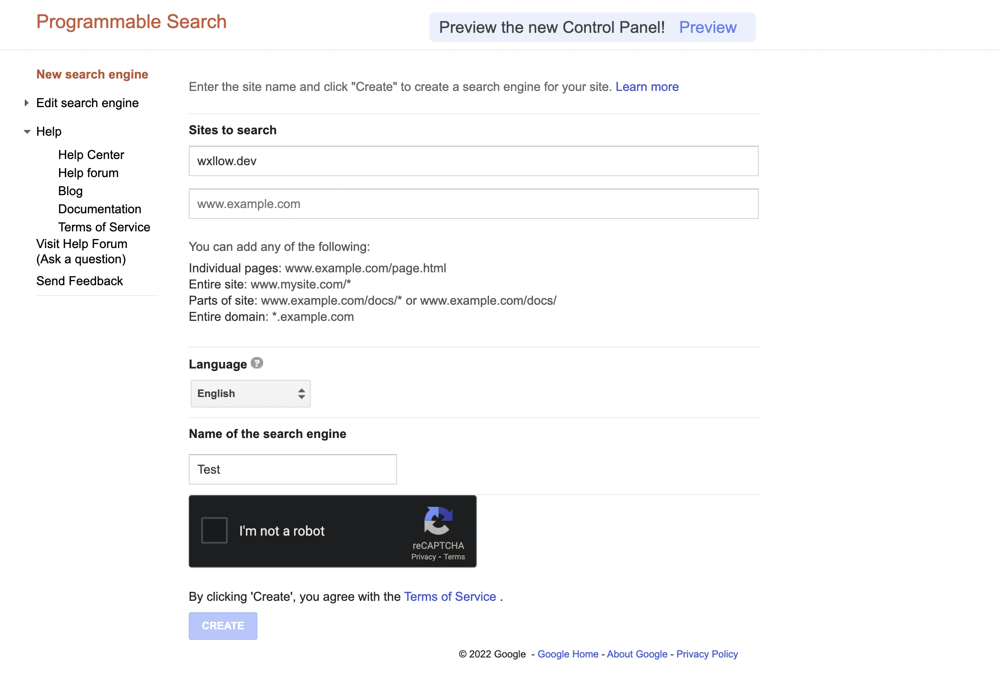
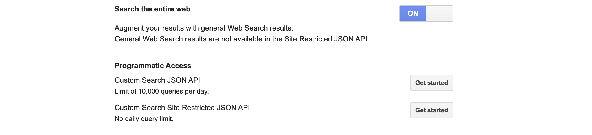

# Setting up Google CSE

## Make your custom search engine

To make a new Google Custom Search Engine, first go to <https://cse.google.com/cse>

Click on the "New search engine" button to create a new search engine.



For the "sites to search" field, just put any website, such as [wxllow.dev](https://wxllow.dev), as this will not matter.

Select your language and name the search engine whatever you want and then create it!

## Configuring your new search engine

Now, go to the control panel for your search engine and scroll down to "Search the entire web" and turn it on! This will allow your search engine to return results from the entire web.



## Getting your API Key

Right below that, click the "Get started" button next to "Custom Search JSON API" to generate an API token in order to access results from our engine using Python. Go through the process in the newly opened tab and write down *(not literally, just copy/paste it)* your key somewhere. 

Go back to your control panel and copy the "Search engine ID"

## Add this to your config.toml file

In your bot's directory, go into the config.toml file and add/modify these two fields with the information you copied:

```toml
[module.search]
google_api_key = 'YourAPIKey'
google_cse_id = 'YourSearchEngineID'
```

## That's it

Now restart your bot and test out the search command :)!
